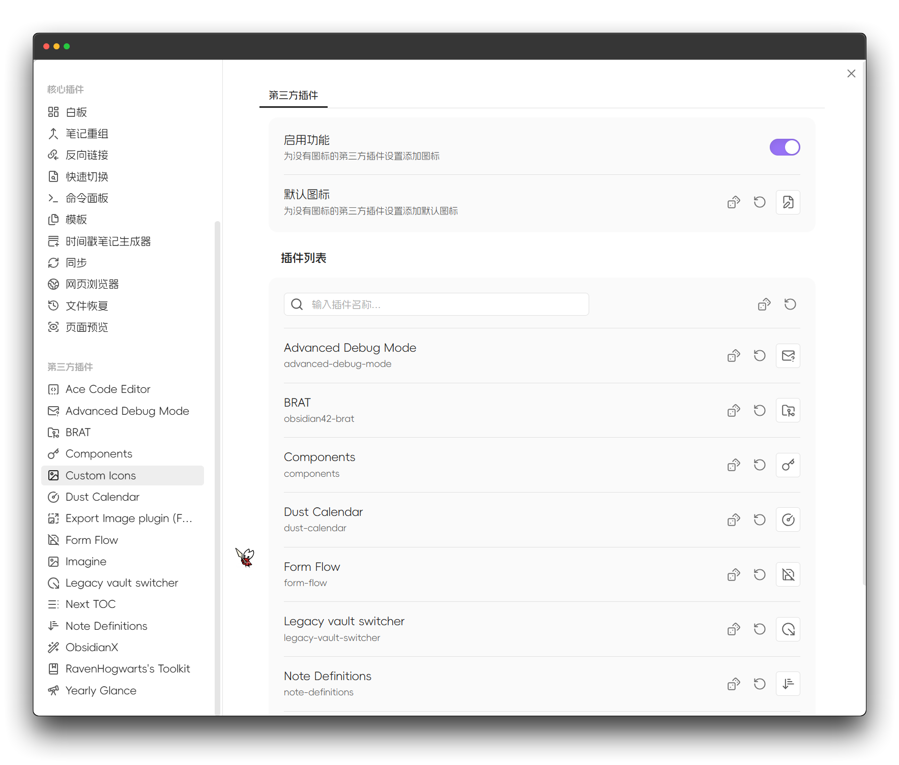

中文 | [English](https://github.com/Raven-Pensieve/obsidian-custom-icons/blob/master/README.md)

# 自定义图标

通过为文档和文件夹设置可自定义的图标，增强您的工作空间美观及易用性。

## v1.0 重要公告：重制版与破坏性更新

本插件 **v1.0** 版本引入了**破坏性更新**，对插件进行了全面**重制**。

- **适配 Obsidian 1.11**：针对 Obsidian 1.11 版本新增的“设置页图标”功能，本插件现在支持**自定义设置页图标**。
- **未来规划**：1.0 版本之前的旧功能（依赖 CSS 实现的部分）计划在未来版本中通过新方法实现，并将不再支持通过 CSS 方式进行自定义。

请务必留意以避免配置失效，建议查看最新的使用文档。

## 使用

## 安装方法
### 社区插件市场安装

[点击安装](obsidian://show-plugin?id=custom-sidebar-icons)，或按以下步骤操作：

1. 打开 Obsidian 并前往 `设置 > 第三方插件`。
2. 搜索 “Custom Icons”。
3. 点击 “安装”。

### BRAT（推荐给测试用户）

1. 安装 [BRAT](https://github.com/TfTHacker/obsidian42-brat) 插件
2. 在 BRAT 设置中点击“添加测试插件”
3. 输入 `Raven-Pensieve/obsidian-custom-icons`
4. 启用插件

## 许可证

此项目基于 xxx LICENSE 许可 - 详情请参阅 [LICENSE](LICENSE) 文件。

## Star 历史

