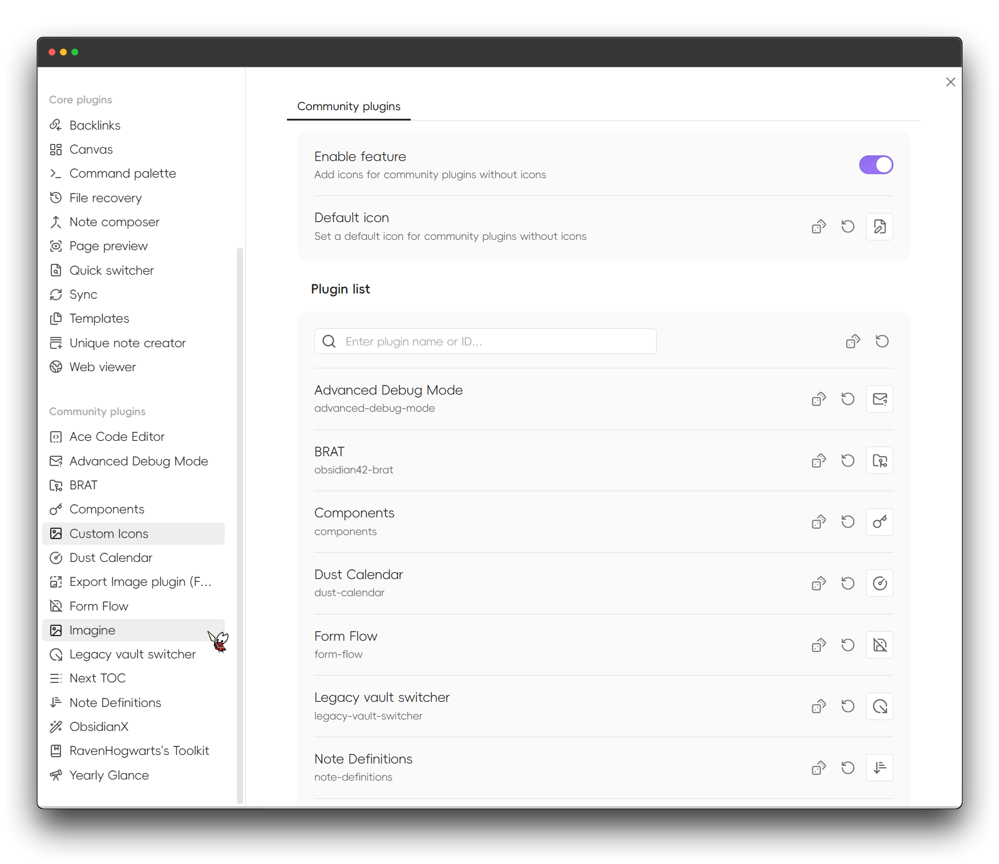

English | [中文](https://github.com/Raven-Pensieve/obsidian-custom-icons/blob/master/README.ZH.md)

# Custom Icons

Enhance your workspace with customizable icons for documents and folders.

## v1.0 Important Notice: Remaster and Breaking Changes

Version **v1.0** of this plugin introduces **breaking changes** and a complete **remaster**.

- **Support for Obsidian 1.11**: Aligned with the new "Settings Page Icons" feature in Obsidian 1.11, this plugin now allows you to **customize icons for the settings page**.
- **Future Roadmap**: Features from versions prior to 1.0 (previously relying on CSS) are planned to be reimplemented using a new method in the future, and CSS-based configuration will no longer be supported.

Please be aware of these changes to ensure your setup continues to work correctly.

## Usage

## Installation
### Community plugin market installation

[Click to install](obsidian://show-plugin?id=custom-sidebar-icons), or:

1. Open Obsidian and go to `Settings > Community Plugins`.
2. Search for "Custom Icons".
3. Click "Install".

### BRAT (Recommended for Beta Users)

1. Install [BRAT](https://github.com/TfTHacker/obsidian42-brat) plugin
2. Click "Add Beta plugin" in BRAT settings
3. Enter `Raven-Pensieve/obsidian-custom-icons`
4. Enable the plugin

## License

This project is licensed under the MIT LICENSE - see the [LICENSE](LICENSE) file for details.

## Star History

## Acknowledgements

- [obsidian-metadata-icon](https://github.com/Benature/obsidian-metadata-icon)
- [Templater](https://github.com/SilentVoid13/Templater)
